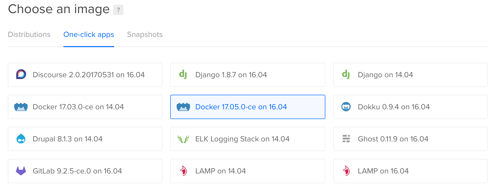
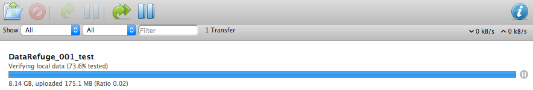

### [Guidelines](README.md) | [Sample torrent file](https://github.com/stevemclaugh/preservation-torrent/blob/master/DataRefuge_001_test.torrent?raw=true)


# Setup guide: Creating and seeding a torrent on a VPS

Create a new virtual private server. I'm using Ubuntu 16.04 on DigitalOcean, with Docker 17.12.0-ce pre-installed.

> 


`ssh` to your new VPS.

```
ssh root@your.ip.address.here
```

Open ports `9091` and `51413` in your firewall and make sure `zip` and `unzip` are installed.

```
ufw allow 9091
ufw allow 51413
apt-get -y install zip unzip
```

Next, download the Docker container we'll be using: my fork of [dperson's container](https://github.com/dperson/transmission) for the open-source BitTorrent client [Transmission](https://transmissionbt.com). I fixed a few bugs and added Transmission's command-line tool for creating new torrents.

```
docker pull stevemclaugh/transmission
```

When it finishes downloading, enter the following command to run the container in detached mode. This will create several new directories in your server's file system under `/home/transmission-daemon/`.

```
docker run --name transmission -it -d -p 51413:51413 -p 51413:51413/udp -p 9091:9091 -v /home/transmission-daemon:/var/lib/transmission-daemon stevemclaugh/transmission
```

`cd` into Transmission's `Downloads` directory.

```
cd /home/transmission-daemon/Downloads
```

Download and unzip our data bundle.

```
wget http://www.stephenmclaughlin.net/Ubu/Ubu_001_test.zip

unzip Ubu_001_test.zip
```


<!--
To create the checksum and zip files we're using:

```
find DataRefuge_001_test/* -type f -exec md5sum {} \;  > DataRefuge_001_test/_checksums.md5

zip -r DataRefuge_001_test.zip DataRefuge_001_test/
```
-->


Next, use the included checksum file to verify that everything has arrived intact. This may take a few minutes.

```
md5sum -c Ubu_001_test/_checksums.md5
```

If every file passes the check, we're ready to create our torrent. Enter the following command to launch a shell session in the running Docker container.


```
docker exec -ti transmission /bin/bash
```

Now `cd` to the `Downloads` directory.

```
cd /var/lib/transmission-daemon/Downloads
```

The following command creates a torrent file for `DataRefuge_001_test/`, which is saved to `transmission-daemon/info/torrents/Ubu_001_test.torrent`.

```
transmission-create -n Ubu_001_test/ \
--tracker udp://tracker.opentrackr.org:1337 \
--tracker http://tracker2.wasabii.com.tw:6969/announce \
-o ../info/torrents/DataRefuge_001_test.torrent
```

Now we'll return to Ubuntu. To close your session in the Docker container, press `ctrl+p`, then `ctrl+q`.

Enter the following two commands to kill the running Docker container and restart it in detached mode.

```
docker rm -f transmission
docker run --name transmission -it -d -p 51413:51413 -p 51413:51413/udp -p 9091:9091 -v /home/transmission-daemon:/var/lib/transmission-daemon stevemclaugh/transmission
```

In your browser, navigate to `your.ip.address.here:9091`. The default username and password are 'admin' and 'admin'. (You can change them by editing `/home/transmission-daemon/info/settings.json`.)

> 

Once Transmission finishes verifying your data, it will seed the files for anyone who opens the torrent file we just created at `/home/transmission-daemon/info/torrents/DataRefuge_001_test.torrent`. Download that file using an FTP client and share it with others.

You can find an active copy of the torrent file we just created [here](https://github.com/stevemclaugh/preservation-torrent/blob/master/Ubu_001_test.torrent?raw=true). Open it with [uTorrent](http://www.utorrent.com/), [Transmission](https://transmissionbt.com/), or your BitTorrent client of choice to start downloading (8.2 GB).


&nbsp;

<p xmlns:dct="http://purl.org/dc/terms/" xmlns:vcard="http://www.w3.org/2001/vcard-rdf/3.0#">
  <a rel="license"
     href="http://creativecommons.org/publicdomain/zero/1.0/">
    
  </a>
</p>
